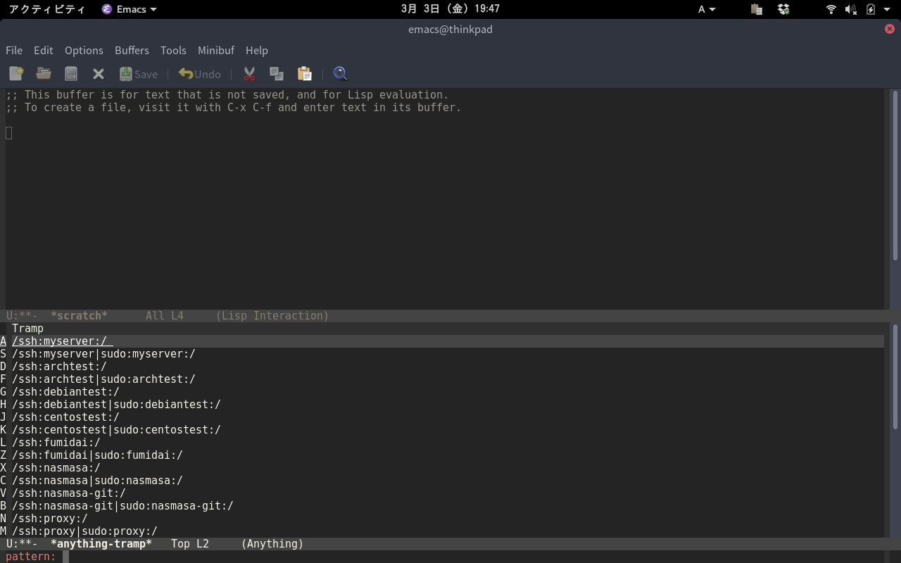

# Warning

Anything and all packages that depend on it have been unsupported from [MELPA](https://melpa.org/#/) now.

https://github.com/melpa/melpa/commit/7d8763a17ecd46efb0bebe6f6a4c8c7791283355

The reason for having been unsupported now is written [here](https://github.com/melpa/melpa/issues/3004#issuecomment-375912059).

Therefore I recommend you are going to install [helm-tramp](https://github.com/masasam/emacs-helm-tramp) or [counsel-tramp](https://github.com/masasam/emacs-counsel-tramp).

# anything-tramp

Tramp with anything for ssh server and docker and vagrant

## Screencast

    M-x anything-tramp

Display server list from your ~/.ssh/config with anything interface.

Filter by anything.

You can connect your server with tramp.

Selecting the list with sudo will lead to the server as root.

Selecting the list of '/sudo:root@localhost:/' will open file at localhost as root.

You can edit your server's nginx.conf on your emacs!.

If you are using [docker-tramp](https://github.com/emacs-pe/docker-tramp.el), docker is also supplemented.

If you are using [vagrant-tramp](https://github.com/dougm/vagrant-tramp), vagrant is also supplemented.

You can edit docker container on your emacs!

	anything-tramp-quit

When you finish editing nginx.conf you clean the tramp buffer with `anything-tramp-quit` command.

## Requirements

- Emacs 24.3 or higher
- anything 1.0 or higher

## Installation

~~You can install `anything-tramp.el` from [MELPA](http://melpa.org) with package.el~~
~~(`M-x package-install anything-tramp`).~~

You can install `docker-tramp.el` from [MELPA](http://melpa.org) with package.el
(`M-x package-install docker-tramp`).

You can install `vagrant-tramp.el` from [MELPA](http://melpa.org) with package.el
(`M-x package-install vagrant-tramp`).

I recommend you are going to install [exec-path-from-shell]( https://github.com/purcell/exec-path-from-shell).

## Sample Configuration

	(setq tramp-default-method "ssh")
    (define-key global-map (kbd "C-c s") 'anything-tramp)

## If you want to speed up tramp

	(add-hook 'anything-tramp-pre-command-hook '(lambda () (global-aggressive-indent-mode 0)
					     (projectile-mode 0)
					     (editorconfig-mode 0)))
	(add-hook 'anything-tramp-quit-hook '(lambda () (global-aggressive-indent-mode 1)
				      (projectile-mode 1)
				      (editorconfig-mode 1)))

Setting hook that turn off slow extensions when you execute anything-tramp.

Setting hook that turn on extensions when you execute `anything-tramp-quit` command.

If you don't make a backup files and lockfiles at remote server, it will be saved faster.

	(setq make-backup-files nil)
	(setq create-lockfiles nil)

## Misc setting

If the shell of the server is zsh it is recommended to connect with bash.

    (eval-after-load 'tramp '(setenv "SHELL" "/bin/bash"))

If you want to specify the user name to connect with docker-tramp.

	(setq anything-tramp-docker-user "username")

If you want to specify multiple user name list to connect with docker-tramp.

	(setq anything-tramp-docker-user '("username1" "username2" "username3" "username4"))

If you want to change initial directory when connecting with /sudo:root@localhost:.

	(setq anything-tramp-localhost-directory "/root")

