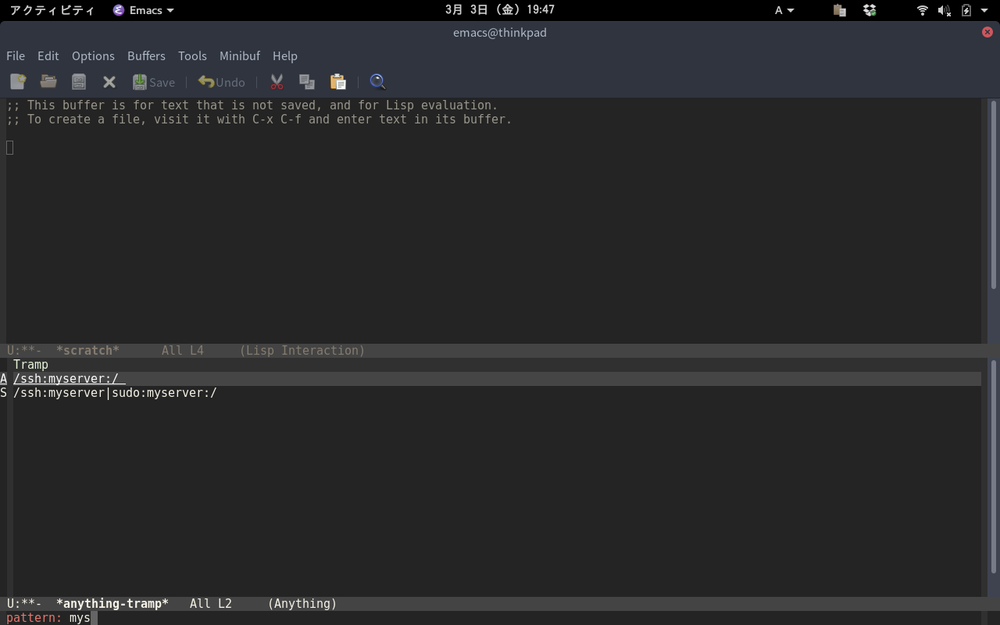
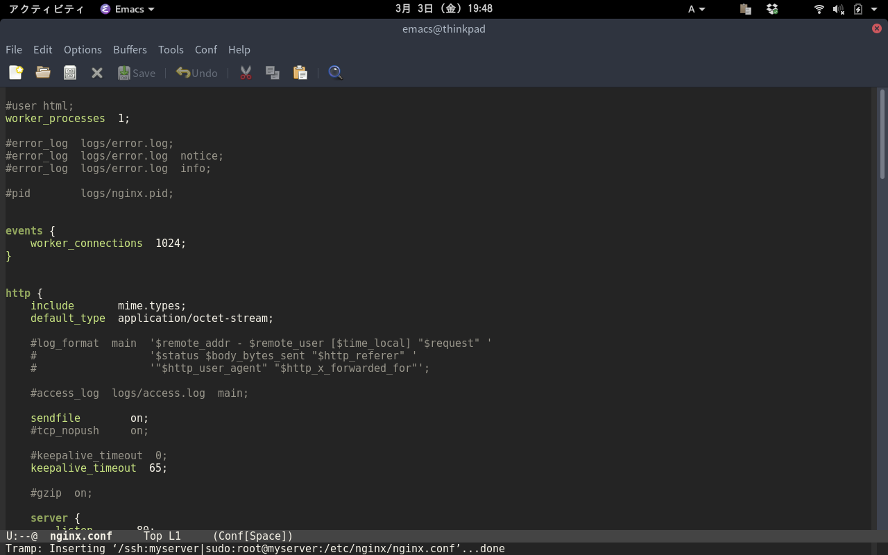

# anything-tramp [![melpa badge][melpa-badge]][melpa-link] [![melpa stable badge][melpa-stable-badge]][melpa-stable-link]

Tramp with anything for server and docker

## Screenshot

    M-x anything-tramp

Display server list from your ~/.ssh/config with anything interface.

Filter by anything.

You can connect your server with tramp.

Selecting the list with sudo will lead to the server as root.

You can edit your server's nginx.conf on your emacs!.

If you are using [docker-tramp](https://github.com/emacs-pe/docker-tramp.el), docker is also supplemented.

You can edit docker container on your emacs!

When you finish editing nginx.conf you clean the tramp buffer with `tramp-cleanup-all-buffers` command.

Since I can not remember `tramp-cleanup-all-buffers` command I set a defalias called `exit-tramp`.

## Requirements

- Emacs 24.3 or higher
- anything 1.0 or higher

## Installation

You can install `anything-tramp.el` from [MELPA](http://melpa.org) with package.el
(`M-x package-install anything-tramp`).

You can install `docker-tramp.el` from [MELPA](http://melpa.org) with package.el
(`M-x package-install docker-tramp`).

## Sample Configuration

	(setq tramp-default-method "ssh")
    (defalias 'exit-tramp 'tramp-cleanup-all-buffers)
    (define-key global-map (kbd "C-c s") 'anything-tramp)

If the shell of the server is zsh it is recommended to connect with bash.

    (eval-after-load 'tramp '(setenv "SHELL" "/bin/bash"))

If you want to specify the user name to connect with docker-tramp.

	(setq anything-tramp-docker-user "username")

[melpa-link]: http://melpa.org/#/anything-tramp
[melpa-badge]: http://melpa.org/packages/anything-tramp-badge.svg
[melpa-stable-link]: http://stable.melpa.org/#/anything-tramp
[melpa-stable-badge]: http://stable.melpa.org/packages/anything-tramp-badge.svg
