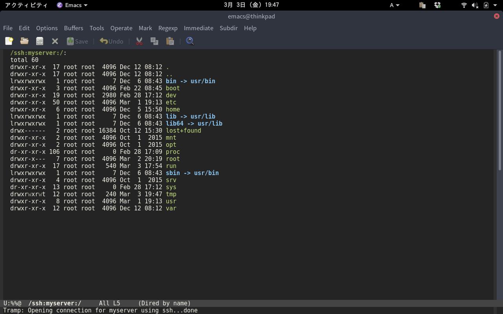
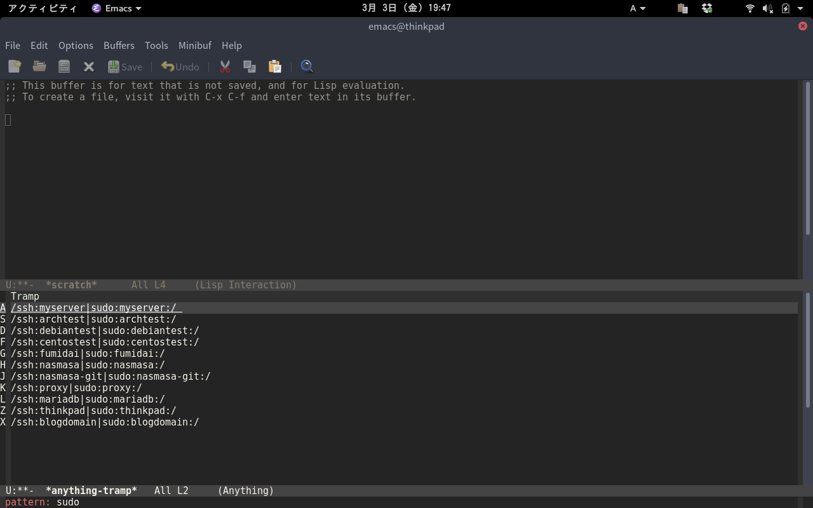

# anything-tramp

Tramp with anything interface

## Screenshot

    M-x anything-tramp  

Display server list from your ~/.ssh/config in anything interface  

Filter by anything  

You can connect your server with tramp  

Selecting the list with sudo will lead to the server as root  

You can edit your server's nginx.conf on your emacs!  

When you finish editing nginx.conf you clean the tramp buffer with `tramp-cleanup-all-buffers` command.  
Since I can not remember `tramp-cleanup-all-buffers` command I set a defalias called `exit-tramp`.  

## Requirements

- Emacs 24 or higher
- anything 1.0 or higher

## Installation

## Sample Configuration

	(setq tramp-default-method "ssh")
    (defalias 'exit-tramp 'tramp-cleanup-all-buffers)
    (define-key global-map (kbd "C-c s") 'anything-tramp)
